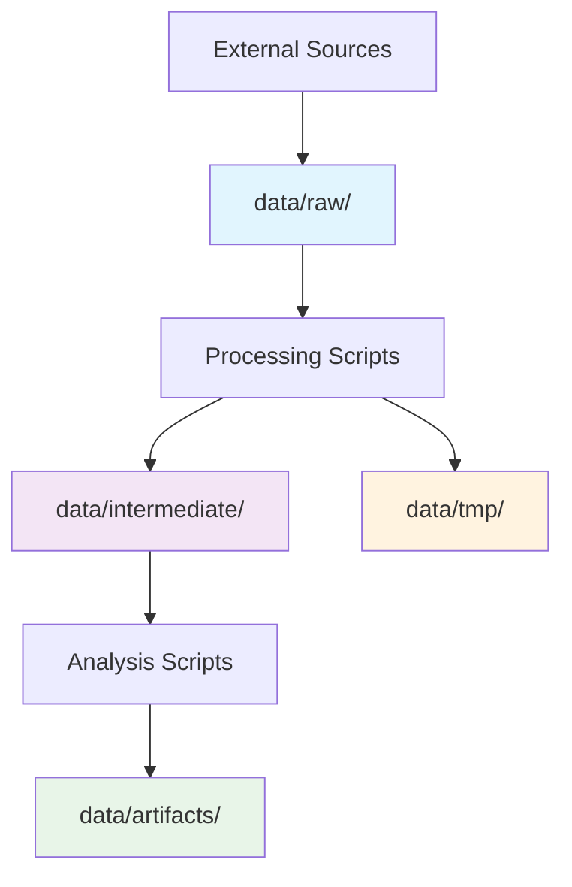

# Data Organization

This document describes the data directory structure and organization principles.

## Directory Structure

```
data/
├── artifacts/          # Final outputs and deliverables
├── raw/               # Original, immutable data
├── intermediate/      # Processed data files
├── tmp/              # Temporary files
└── .gitignore        # Git ignore rules for data directories
```

## Data Flow



## Directory Descriptions

### `data/raw/`
- **Purpose**: Store original, unmodified data files
- **Rules**: 
  - Never modify files in this directory
  - Treat as read-only after initial placement
  - Document data sources and acquisition dates
- **Examples**: CSV files from APIs, downloaded datasets, survey responses

### `data/intermediate/`
- **Purpose**: Store processed data files between analysis steps
- **Rules**:
  - Can be regenerated from raw data + scripts
  - Include metadata about processing steps
  - Use descriptive filenames with processing stage
- **Examples**: `cleaned_survey_data.csv`, `normalized_features.parquet`

### `data/artifacts/`
- **Purpose**: Store final outputs and deliverables
- **Rules**:
  - Results that would be shared or presented
  - Include version information when relevant
  - Document generation process
- **Examples**: Final reports, trained models, visualization outputs

### `data/tmp/`
- **Purpose**: Temporary files during processing
- **Rules**:
  - Can be deleted safely at any time
  - Cleaned regularly by `just clean-data`
  - Never commit important work here
- **Examples**: Partial downloads, debug outputs, cache files

## Git Configuration

All data directories are configured with `.gitignore` files that:
- Ignore all files in each directory
- Preserve the `.gitignore` files themselves
- Maintain directory structure in the repository

This prevents accidental commits of large data files while preserving the project structure.

## Best Practices

1. **Document data sources** in `docs/` or notebook metadata
2. **Use descriptive filenames** that indicate content and processing stage
3. **Include timestamps** in filenames for time-series data
4. **Compress large files** when possible (`.gz`, `.parquet`)
5. **Back up important raw data** outside of this project structure
6. **Clean temporary files** regularly using `just clean-data`

## File Naming Conventions

- Use lowercase with underscores: `survey_responses_2024.csv`
- Include processing stage: `01_raw_data.csv`, `02_cleaned_data.csv`
- Include dates for temporal data: `daily_metrics_2024_01_15.csv`
- Use standard extensions: `.csv`, `.parquet`, `.json`, `.pkl`